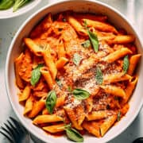

# Making my favorite Meal

## Ingredients needed
- Olive oil
- Onion
- Garlic
- Italian seasoning
- Tomato paste
- Salt
- Pepper
- Chicken broth
- Pasta
- Sun-dried tomatoes
- Canned diced tomatoes
- Cream cheese
- Parmesan cheese
- Fresh parsley (optional)

## Cooking instructions

1. **Heat the pan**
2. **Add olive oil to the heated pan**
3. **Add onion and garlic to the pan**
4. **Cook for 2 minutes**

**Stir in tomato paste and Italian seasoning**
- stirInTomatoPaste()
- addItalianSeasoning()
- continueCooking()

**Add liquids and pasta**
- addChickenBroth()
- addDicedTomatoesAndPasta()

Simmer until pasta is done
- if pastaIsNotDone():
        simmer()

- if sauceIsSoupy():
        waitAdditionalMinutes(3)
        

**When pasta is cooked, add grated parmesan and cream cheese**
- addParmesan()
- addCreamCheese()

**Let pasta sit for a few minutes to thicken further**

**Serve hot with Baguette or Garlic Bread**